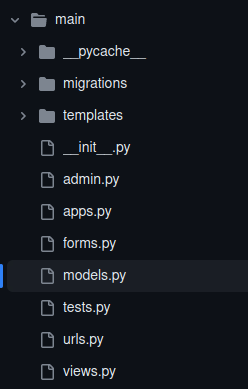

//caminho padrão para imagens
:imagesdir: images
:figure-caption: Figura
:doctype: book

//gera apresentacao
//pode se baixar os arquivos e add no diretório
:revealjsdir: https://cdnjs.cloudflare.com/ajax/libs/reveal.js/3.8.0

//GERAR ARQUIVOS
//make slides
//make ebook

//Estilo do Sumário
:toc2: 
//após os : insere o texto que deseja ser visível
:toc-title: Sumário
:figure-caption: Figura
//numerar titulos
:numbered:
:source-highlighter: highlightjs
:icons: font
:chapter-label:
:doctype: book
:lang: pt-BR
//3+| mesclar linha tabela

= Criando Views, URLs e Templates de Pessoa Física =

== Criando Views == 

=== Entendendo a Estrutura de Views em Django: ===

Em Django, views são responsáveis por processar as requisições do cliente e retornar uma resposta. Elas representam a lógica de negócios do seu aplicativo. Aqui estão algumas considerações importantes:

- Funções de Views: Views podem ser funções simples ou classes baseadas em métodos Class-Based View(CBV). As CBVs fornecem uma abordagem orientada a objetos para organizar a lógica da view.

- Requisições e Respostas: As views recebem objetos de requisição e devem retornar objetos de resposta. O objeto de resposta pode ser uma página HTML renderizada, um redirecionamento, um JSON, etc.

=== Criando Views para Listar, Exibir, Criar, Atualizar e Excluir Registros: ===

.view para PessoaFisica método 1
[source, python]
----
from django.shortcuts import render, redirect
from .models import PessoaFisica

def pf_lista(request):
    pessoas_fisicas = PessoaFisica.objects.all()
    return render(request, "pf_lista.html", {'listapessoafisica': pessoas_fisicas})

def pf_novo(request):
    rNome = request.POST.get("nome")
    rEmail = request.POST.get("email")
    rCpf = request.POST.get("cpf")
    rData_nascimento = request.POST.get("data_nascimento")
    Pessoa.objects.create(nome = rNome, email = rEmail, cpf = rCpf, data_nascimento = rData_nascimento)
    pessoas = Pessoa.objects.all()
    return redirect(pf_lista)

def pf_editar(request, id):
    pessoa_fisica = Pessoa.objects.get(id = id)
    return render(request, "pf_form.html", {'pessoa_fisica':pessoa_fisica})

def pf_update(request, id):
    pessoa = Pessoa.objects.get(id = id)
    pessoa.nome = request.POST.get("nome")
    pessoa.email = request.POST.get("email")
    pessoa.cpf = request.POST.get("cpf")
    pessoa.data_nascimento = request.POST.get("data_nascimento")
    pessoa.save()
    return redirect(pf_lista)

def pf_delete(request, id):
    pessoa = Pessoa.objects.get(id = id)
    pessoa.delete()
    return redirect(pf_lista)
----

=== Configurando URL para Pessoa Fisica ===

.urls.py de main
[source, python]
----
from django.urls import path
from main import views

urlpatterns = [
    path('', views.index, name='index'),
    path('pessoa_fisica/lista/', views.pf_lista, name='lista_pessoa_fisica'),
    path('pessoa_fisica/novo/', views.pf_novo, name='novo_pessoa_fisica'),
    path('pessoa_fisica/editar/<int:id>/', views.pf_editar, name='novo_pessoa_fisica'),
    path('pessoa_fisica/update/<int:id>/', views.pf_update, name='update_pessoa_fisica'),
    path('pessoa_fisica/delete/<int:id>/', views.pf_delete, name='delete_pessoa_fisica'),
]
----

=== Criando Templates de Pessoa Física ===

Para criar Templates no `Python` é preciso criar uma pasta chamada `templates` dentro do diretório do aplicativo que você está utilizando

.Estrutura do Aplicativo Main

==== Template base do Projeto ====

.template base.html
[source, html]
----
<!DOCTYPE html>
<html lang="pt-br">

<head>
    <meta charset="UTF-8">
    <meta name="viewport" content="width=device-width, initial-scale=1.0">
    <title></title>

    <!-- Bootstrap CSS -->
    <link href="https://cdn.jsdelivr.net/npm/bootstrap@5.3.2/dist/css/bootstrap.min.css" rel="stylesheet" integrity="sha384-T3c6CoIi6uLrA9TneNEoa7RxnatzjcDSCmG1MXxSR1GAsXEV/Dwwykc2MPK8M2HN" crossorigin="anonymous">
</head>

<body>
    

        <nav class="navbar navbar-expand-lg navbar-dark bg-primary">
            

                <a class="navbar-brand" href="#">Seu Site</a>
                <button class="navbar-toggler" type="button" data-toggle="collapse" data-target="#navbarNav"
                    aria-controls="navbarNav" aria-expanded="false" aria-label="Toggle navigation">
                    
                </button>
                

                    <ul class="navbar-nav">
                        <li class="nav-item active">
                            <a class="nav-link" href="">Home</a>
                        </li>
                        <li class="nav-item">
                            <a class="nav-link" href="">Pessoa Física</a>
                        </li>
                        <li class="nav-item">
                            <a class="nav-link" href="#">Pessoa Jurídica</a>
                        </li>
                    </ul>
                

            

        </nav>
    

    

    <!-- Bootstrap JS e Popper.js (necessários para alguns componentes do Bootstrap) -->
    
    
        
</body>

</html>
----

=== Template Principal ===

.index.html
[source, html]
----


Home


  

    <h2>Escolha o Tipo de Pessoa</h2>

    

      

        

          

            <h5 class="card-title">Pessoa Física</h5>
            
Crie uma nova pessoa física.

            <a href="" class="btn btn-primary">Criar Pessoa Física</a>
          

        

      

      

        

          

            <h5 class="card-title">Pessoa Jurídica</h5>
            
Crie uma nova pessoa jurídica.

            <a href="" class="btn btn-primary">Criar Pessoa Jurídica</a>
          

        

      

    

  


----

==== Template para Listar Pessoa Fisica ====

Agora o Template para a listagem de `PessoaFisica`:

.template pf_list.html
[source, html]
----


Lista de Pessoa Fisica


  

    <h2>Lista de Pessoas Físicas</h2>
    

      <a class="btn btn-primary" href="">Novo</a>
    

    <table class="table table-bordered">
      <thead>
        <tr>
          <th>Nome</th>
          <th>Email</th>
          <th>CPF</th>
          <th>Data de Nascimento</th>
          <th>Ações</th>
        </tr>
      </thead>
      <tbody>
        
          <tr>
            <td>{{ pessoa_fisica.nome }}</td>
            <td>{{ pessoa_fisica.email }}</td>
            <td>{{ pessoa_fisica.cpf }}</td>
            <td>{{ pessoa_fisica.data_nascimento }}</td>
            <td>
              <a href="" class="btn btn-primary btn-sm">Editar</a>
              <a href="" class="btn btn-danger btn-sm">Excluir</a>
            </td>
          </tr>
        
      </tbody>
    </table>

  


----

==== Template de Formulário de Pessoa Fisica ====

Este template será utilizado para Cadastrar e Editar uma pessoa Física

.pf_form.html
[source, html]
----


Cadastro de Pessoa Física


  

    
      <h2>Editar Pessoa Física</h2>
    
      <h2>Adicionar Nova Pessoa Física</h2>
    

    <form method="post" action="">
        
        <label class="form-control" for="nome">Nome:</label>
        <input class="form-control" type="text" name="nome" id="nome" value="{{ pessoa_fisica.nome }}">
        <label class="form-control" for="email">Email:</label>
        <input class="form-control" type="email" name="email" id="email" value="{{ pessoa_fisica.email }}">
        <label class="form-control" for="cpf">CPF:</label>
        <input class="form-control" type="number" name="cpf" id="cpf" value="{{ pessoa_fisica.cpf }}">
        <label class="form-control" for="data_nascimento">Data de Nascimento:</label>
        <input class="form-control" type="date" name="data_nascimento" id="data_nascimento" value="{{ pessoa_fisica.data_nascimento }}">
        <button class="btn btn-primary" type="submit">AtualizarSalvar</button>
    </form>

    <a href="" class="btn btn-secondary mt-3">Voltar para Lista</a>
  


----

Com isso está finalizado todo o CRUD da classe `PessoaFisica`.

link:https://hemmerson.github.io/django-aula/[HOME]